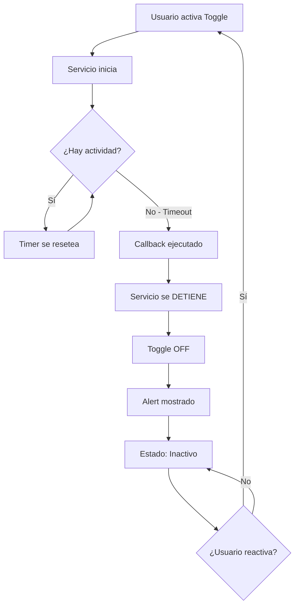

# 🔄 Comportamiento del Servicio al Detectar Inactividad

## 🎯 Flujo de Ejecución

### **ANTES (Problema):**
```
1. Usuario activa toggle ✅
2. Servicio inicia monitoreo ✅
3. Pasan X minutos sin actividad ⏱️
4. Timeout alcanzado! ⚠️
5. Muestra Alert "Inactivity Detected" ✅
6. ❌ Resetea timer y continúa monitoreando
7. ❌ Vuelve a mostrar Alert cada X minutos (bucle infinito)
```

**Problema:** El servicio nunca se detenía, seguía detectando "inactividad" infinitamente.

---

### **AHORA (Solución):**
```
1. Usuario activa toggle ✅
2. Servicio inicia monitoreo ✅
3. Pasan X minutos sin actividad ⏱️
4. Timeout alcanzado! ⚠️
5. ✅ DETIENE el servicio primero
6. ✅ Actualiza el toggle a OFF
7. ✅ Muestra Alert "Inactivity Detected"
8. ✅ Servicio completamente detenido
9. Usuario debe reactivar toggle manualmente para continuar
```

**Beneficios:**
- ✅ No hay bucle infinito
- ✅ El usuario tiene control total
- ✅ La notificación desaparece automáticamente
- ✅ Ahorra batería al detener el servicio

---

## 📝 Cambios Realizados

### 1. **useInactivityMonitoring.ts** - Hook actualizado

```typescript
const handleInactivityDetected = useCallback(async () => {
    console.log('[Hook] Inactivity detected! Should navigate to home...');

    // 🔑 CAMBIO CLAVE: Detener el servicio ANTES del Alert
    await InactivityService.stop();
    setIsMonitoring(false);  // Toggle se pone en OFF

    // Mostrar alert informativo
    Alert.alert(
        '🏠 Inactivity Detected',
        'Simulating home button press...\n\nMonitoring has been stopped. Activate the toggle again to resume.',
        [{ text: 'OK' }]
    );
}, []);
```

**Orden de ejecución:**
1. Detener servicio
2. Actualizar estado del toggle
3. Mostrar alert al usuario

### 2. **InactivityService.ts** - Servicio actualizado

```typescript
// Check if timeout reached
if (elapsedMinutes >= this.timeoutMinutes) {
    console.log('[SleepGuard] Inactivity timeout reached!');
    if (this.onInactivityCallback) {
        this.onInactivityCallback();
    }
    // ❌ REMOVIDO: this.resetTimer();
    // ✅ El callback se encarga de detener el servicio
}
```

**Antes:**
- Ejecutaba callback
- Reseteaba timer
- Continuaba monitoreando (bucle infinito)

**Ahora:**
- Ejecuta callback
- El callback detiene el servicio
- Monitoreo termina completamente

---

## 🎬 Ejemplo de Uso Real

### **Escenario: Usuario jugando antes de dormir**

```
20:00 → Usuario activa SleepGuard (timeout: 30 min)
20:30 → Sigue jugando (timer se resetea con cada toque)
21:00 → Se queda dormido sin tocar el dispositivo
21:30 → ⏰ TIMEOUT ALCANZADO!
      → SleepGuard se detiene automáticamente
      → Muestra alert (pero usuario está dormido)
      → Notificación desaparece
      → Servicio completamente detenido
      → ✅ No volverá a detectar inactividad

Mañana siguiente:
08:00 → Usuario despierta
      → Ve el alert de "Inactivity Detected"
      → Toggle está en OFF
      → Puede volver a activarlo si quiere
```

---

## 🔄 Ciclo de Vida Completo



---

## 📊 Comparación

| Aspecto | Antes | Ahora |
|---------|-------|-------|
| Detección inicial | ✅ Funciona | ✅ Funciona |
| Muestra alert | ✅ Funciona | ✅ Funciona |
| Después del alert | ❌ Sigue monitoreando | ✅ Se detiene |
| Toggle estado | ❌ Sigue ON | ✅ Cambia a OFF |
| Notificación | ❌ Permanece | ✅ Desaparece |
| Consumo batería | ❌ Continúa | ✅ Se detiene |
| Control usuario | ❌ No claro | ✅ Debe reactivar |

---

## 🧪 Cómo Probar

### **Prueba Rápida (1 minuto):**

1. **Configura timeout a 1 minuto**
   ```typescript
   const [timeoutMinutes, setTimeoutMinutes] = useState(1);
   ```

2. **Activa el toggle**
   - Toggle debe ponerse verde ✅
   - Notificación debe aparecer ✅

3. **NO TOQUES el dispositivo por 1 minuto completo**
   - Espera sin interactuar

4. **Después de 1 minuto:**
   - ✅ Toggle debe cambiar a gris (OFF)
   - ✅ Alert "Inactivity Detected" debe aparecer
   - ✅ Notificación debe desaparecer
   - ✅ Logs: `[SleepGuard] Stopping service...`

5. **Verifica que NO vuelva a aparecer el alert**
   - Espera otros 2-3 minutos
   - El alert NO debe aparecer de nuevo ✅

### **Logs Esperados:**

```
[SleepGuard] Starting service...
[SleepGuard] Remaining: 1.0 min
[SleepGuard] Remaining: 0.8 min
[SleepGuard] Remaining: 0.5 min
[SleepGuard] Remaining: 0.3 min
[SleepGuard] Remaining: 0.0 min
[SleepGuard] Inactivity timeout reached!
[Hook] Inactivity detected! Should navigate to home...
[SleepGuard] Stopping service...
[SleepGuard] Service stopped successfully
// ✅ Ya no hay más logs después de esto
```

---

## 💡 Próxima Implementación

Cuando implementemos el presionado real del botón Home:

```typescript
const handleInactivityDetected = useCallback(async () => {
    console.log('[Hook] Inactivity detected!');

    // 1. Presionar botón Home (Accessibility Service)
    await NativeModules.AccessibilityModule.pressHomeButton();

    // 2. Detener servicio
    await InactivityService.stop();
    setIsMonitoring(false);

    // 3. (Opcional) Mostrar toast breve
    ToastAndroid.show('SleepGuard: Returning to home', ToastAndroid.SHORT);
}, []);
```

**Flujo final:**
1. Detecta inactividad
2. Presiona Home → Usuario ve el launcher
3. Detiene servicio
4. Toggle OFF
5. Usuario debe reactivar manualmente si quiere

---

## ✅ Checklist de Comportamiento Correcto

Después de reconstruir, verifica:

- [ ] Toggle activa el servicio (verde)
- [ ] Notificación aparece
- [ ] Después del timeout, Toggle cambia a OFF
- [ ] Alert aparece una sola vez
- [ ] Notificación desaparece
- [ ] Servicio NO vuelve a detectar inactividad
- [ ] Logs confirman "Service stopped successfully"
- [ ] Reactivar el toggle funciona normalmente

---

**Estado:** ✅ Comportamiento correcto implementado - el servicio se detiene automáticamente al detectar inactividad
